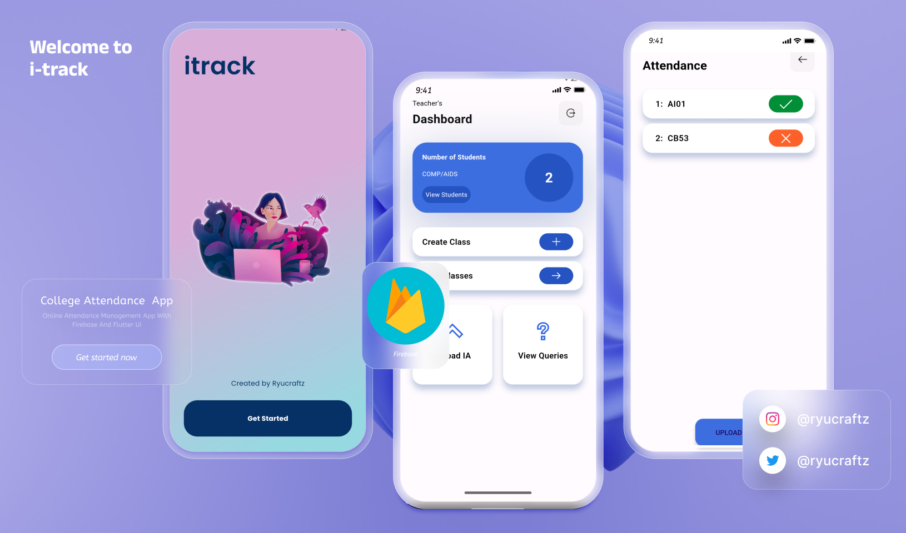
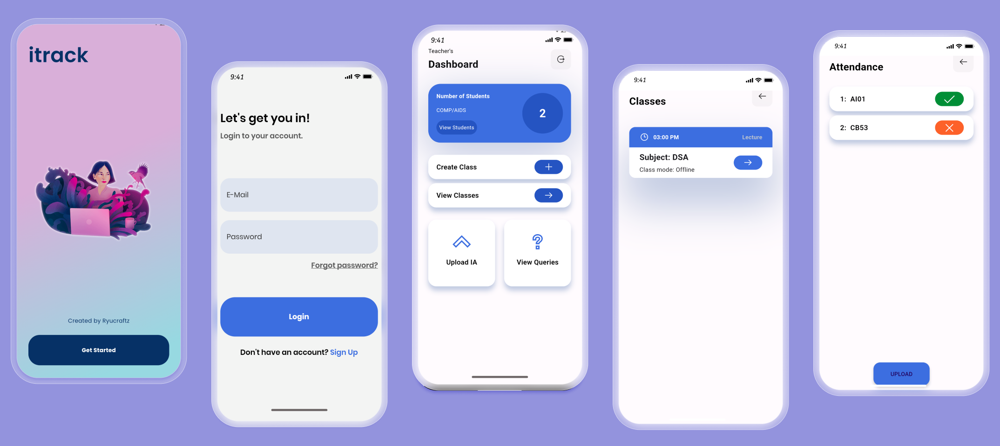

# SpentWise

## Stack

- [Flutter](https://flutter.dev/) - A UI toolkit for building natively compiled applications for mobile, web, and desktop from a single codebase.
- [Firebase](https://firebase.google.com/) - A platform developed by Google for creating mobile and web applications.

## License

MIT License.

---
